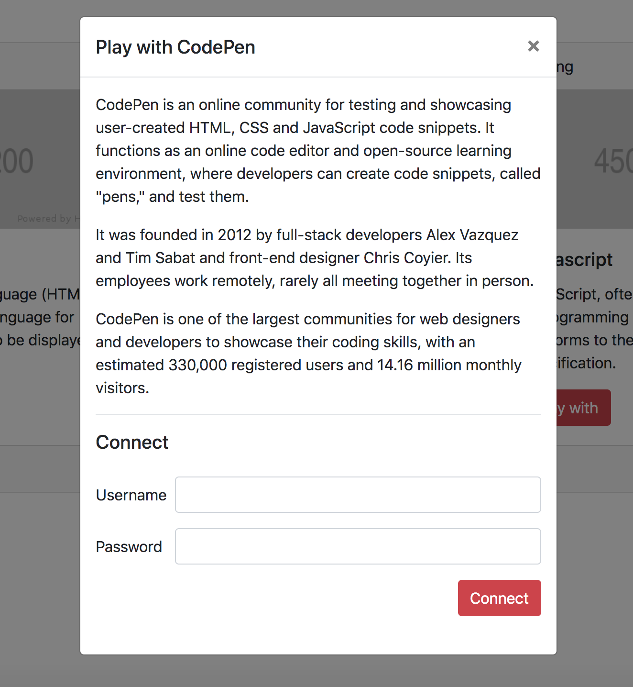
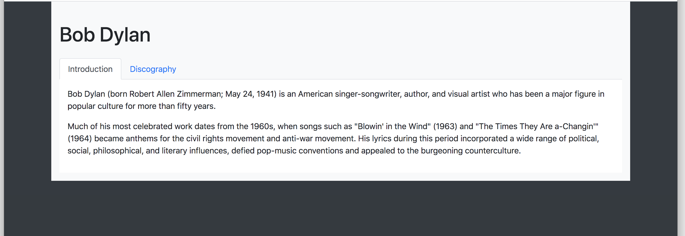
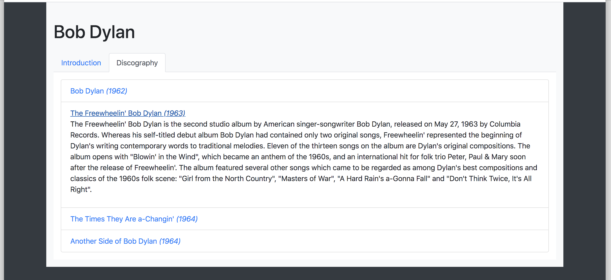

# 0x0A. Bootstrap

## Tasks

***0. Reboot styling***

***1. Blocks***

***2. Table of chemical elements***

***3. Cards***

***4. Bob Dylan***

***5. Show/Hide - screen size***

***6. Overwrite CSS***

